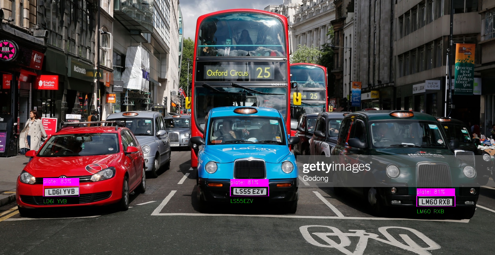
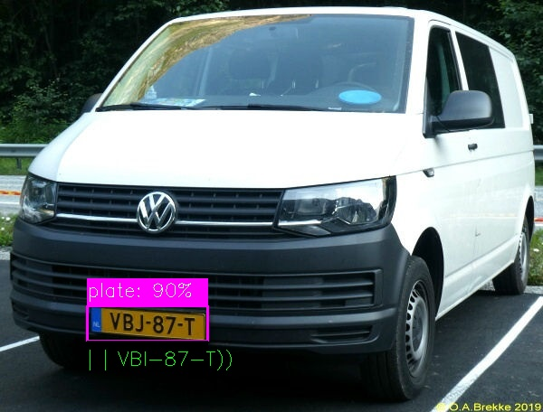

# automatic license plate recognition using deep learning
Automated license plate recognition, also known as ANPR (Automatic Number Plate Recognition), is a technology designed to identify vehicle license plates through the use of optical character recognition techniques. This system is used to identify and register all the vehicles that enter or leave the parking lot, obtaining a great control of the vehicles license plates and therefore an increased security.

## Data Preparation
- I collected data from Google Images. You can find the used images in YOLO\images directory
- Data labeling was performed used the tool LabelImg, you can download it [here](https://github.com/heartexlabs/labelImg).

## How to run the model
- Download the YOLO model (Model/weights/best.onnx) and make sure you specify diectory for it (I've used project's home directory).
- Use global pip install to install following modules: OpenCV and numpy
- Install pytesseract in your OS
- Run main.py in the YOLO directory
Enjoy !!

## Some Results

